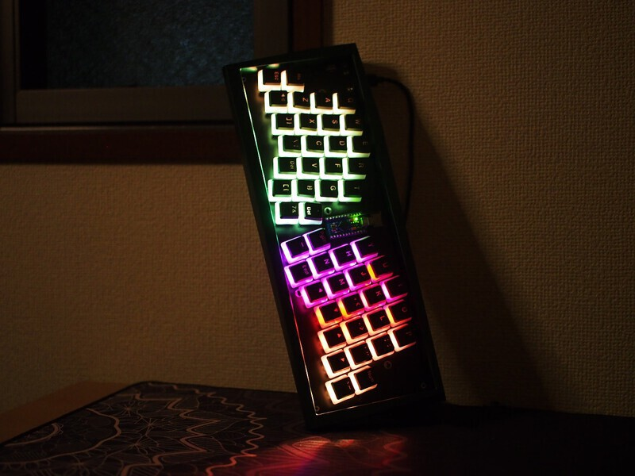
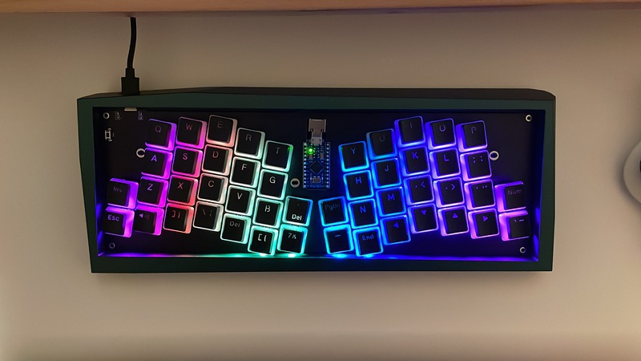
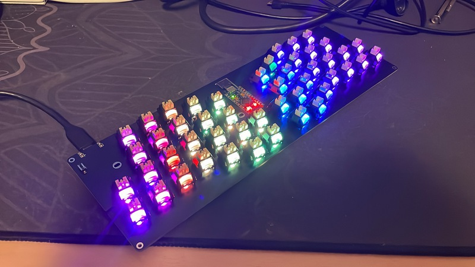

# Potreus Keyboard

The Potreus Keyboard is a row staggered mechanical keyboard optimized 60% caces. Inspired by [Atreus Keyboard](https://gitlab.com/technomancy/atreus).

## Images

## License

Copyright © 2021 mackee

Released under the [CC BY-SA 4.0](https://creativecommons.org/licenses/by-sa/4.0/).
